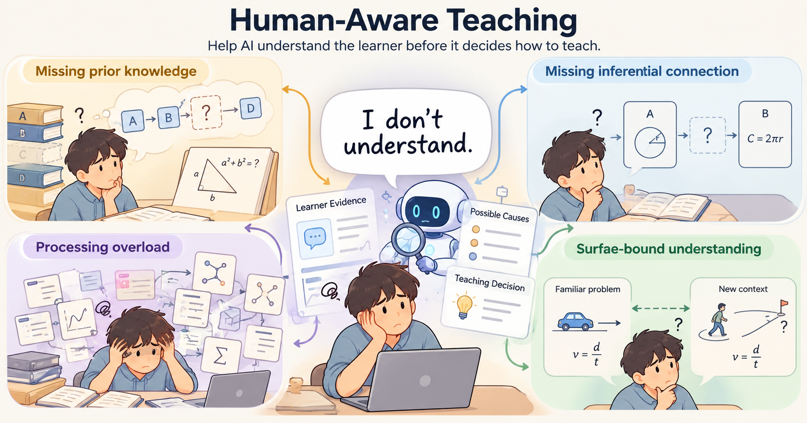
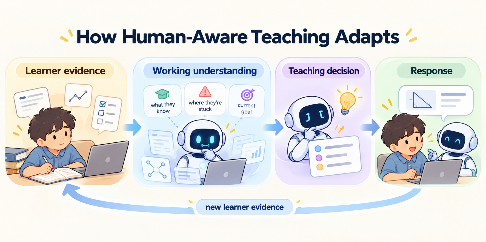

# Human-Aware Teaching

**让 AI 在决定如何教之前，先理解学习者。**



[English](README.md) · [简体中文](README.zh-CN.md)

AI 已经可以解释概念、举例、给提示、提问和安排练习。更难的判断发生在这些方法之前：**这个学习者为什么卡住？他已经理解了什么？**

Human-Aware Teaching 是一个通用 Agent Skill。它以认知科学和学习科学为基础，为这个判断提供明确的推理流程：根据学习者说了什么、能够做什么，选择下一步回应，再随着新证据调整。

[工作方式](#这个-skill-如何做出判断) · [安装](#安装) · [阅读 Skill](SKILL.md)

## 同一个信号，不同的下一步

> “我不理解。”

这句话背后有几种可能：

| 可能的困难 | 可能有帮助的下一步 |
| --- | --- |
| 缺少必要的先备知识 | 补上进入下一步所需的知识。 |
| 知道各个部分，却连接不起来 | 在当前例子中，把缺失的关系讲清楚。 |
| 需要同时记住和处理的内容太多 | 减少同时加工的内容，保留一条连贯的解释主线。 |
| 理解依赖某个熟悉的例子 | 比较不同例子中的共同结构。 |

例如，学习者能跟着一道例题走完，题目换一种说法就卡住。一个小提示可能让他想起相关原理，并独立完成剩下的步骤。如果原理已经想起来了，却仍然无法对应到新题目，就需要把两个问题的共同结构讲得更清楚。这两种回应针对的是不同困难。

这个区别会影响学习。检索知识本身是一种主动加工，能够帮助之后使用这些知识；比较不同例子中的关系，可以支持可迁移图式的形成。AI 需要判断，此刻哪一种加工更能帮助这个学习者。[Karpicke & Blunt, 2011](https://learninglab.psych.purdue.edu/downloads/2011/2011_Karpicke_Blunt_Science.pdf)，[Gick & Holyoak, 1983](https://reasoninglab.psych.ucla.edu/wp-content/uploads/sites/273/2021/04/Gick_Holyoak1983_SchemaInduction.pdf)

## 这个 Skill 如何做出判断

Human-Aware Teaching 沿着一个自适应循环展开：观察学习者，形成对当前理解的工作判断，选择教学行动，再给出回应。



它从学习者的表达、推理、表现、目标和相关对话历史出发，形成对当前理解的工作判断，找到最小的关键缺口，再选择能够补上这个缺口的回应。学习者的下一次反馈会更新这个判断。

如果几种解释都说得通，而它们会导向不同的教学行动，Skill 会寻求能够区分它们的证据。如果同一个解释或澄清在这些情况下都有帮助，就继续讲下去。提问的作用是帮助选择下一步，或者让学习者建立需要自己形成的关系。

具体行动可以是补上一段推理、比较两个模型、画出一种表示、给出提示、支持检索，或直接回答。当前对象或例子能够承载解释时，就沿着它讲清楚。讲解深度与互动方式跟随学习者的目标，指导则随着独立表现的提升逐步减少。

个性化以当前证据和明确偏好为依据，并随着学习者的进展修正。学习风格综述发现，按照“视觉型学习者”“听觉型学习者”等固定标签分配教学，缺乏充分的证据支持。这个 Skill 关注学习者实际表现了什么，以及什么在当前任务中有帮助。[Pashler et al., 2008/2009](https://people.uncw.edu/kozloffm/nolearningstylespdf.pdf)

## 教学方法只是决策的一部分

学习取决于学习者带着什么进入当前任务。已有知识影响新信息的解释和组织；注意、记忆、推理和动机影响学习者能够如何使用它。因此，教学策略的效果取决于学习者、材料和目标。[《How People Learn II》, National Academies, 2018](https://uwnxt.nationalacademies.org/read/24783/chapter/7)

即使是效果明确的指导，也会随着专长的发展改变价值。逐步指导可以帮助新手建立可用的模型；模型已经形成后，同样的指导可能变得冗余，甚至妨碍学习。专长逆转效应给出了一个具体理由：学习者在进步，支持的多少和形式也需要改变。[Kalyuga et al., 2003](https://doi.org/10.1207/S15326985EP3801_4)

一个例子可能帮助学习者把新概念接到已有知识上，也可能让他跟完步骤，却没有理解其中的关系。Knowledge–Learning–Instruction 框架把教学条件、所学知识和改变知识的过程联系起来。CoDiL 则区分学习机会、可观察活动、内部认知过程与学习结果。这些框架帮助解释：知道提供了什么活动，仍然留下了“学习者理解了什么”的问题。[Koedinger et al., 2012](https://files.eric.ed.gov/fulltext/ED535880.pdf)，[Reinhold et al., 2024](https://link.springer.com/article/10.1007/s10648-024-09845-6)

一个围绕教学方法编写的 Skill，可以给 AI 一套执行步骤。AI 还需要判断这套步骤什么时候合适、应该解决什么缺口，以及什么时候改变做法。**学习者当前的理解为这些判断提供依据。**

## 为什么这个判断对 AI 教学很重要

LLM 拥有大量学科知识和教学知识。要用好这些知识，还需要关于当前学习者的证据。LearnLM 等工作已经把教学行为作为明确的设计、训练与评价目标。Human-Aware Teaching 进一步让学习者不断变化的理解进入下一步教学决策。[Jurenka et al., 2024](https://arxiv.org/abs/2407.12687)

互动方式会影响学习者最终获得什么。在一项高中数学实地实验中，GPT-4 助手使辅助练习表现相对控制组提高了 48%。移除 AI 后，这一组在无辅助考试中的成绩低了 17%。加入学习保护措施的 tutor 版本大幅消除了这项考试损失。借助 AI 完成更多任务，与形成能够独立使用的能力，可能出现分离。[Bastani et al., 2025](https://www.pnas.org/doi/10.1073/pnas.2422633122)

经过细致设计的 AI 教学也能带来良好的学习效果。在一项大学物理实验中，按照教学研究设计的 AI tutor，其后测表现高于课堂主动学习。结合这些研究，我们有理由把 AI 如何教，放在与它能够给出什么答案同样重要的位置。[Kestin et al., 2025](https://www.nature.com/articles/s41598-025-97652-6)

Human-Aware Teaching 把这个设计目标落实为一个可复用的 Agent Skill：根据学习者证据选择回应，再根据回应对学习者的影响决定下一步。[研究细节与设计依据](references/scientific-grounding.md)

## 安装

在准备使用这个 Skill 的项目中运行：

```sh
npx skills add yuanmingze2008/human-aware-teaching-skill
```

在安装器中选择宿主。添加 `--global` 可以让 Skill 跨项目使用。[skills CLI](https://github.com/vercel-labs/skills) 需要 Node.js 22.20 或更新版本。

<details>
<summary>Codex</summary>

```sh
npx skills add yuanmingze2008/human-aware-teaching-skill --agent codex
```

安装器会把 Skill 放到当前项目的 `.agents/skills/human-aware-teaching/`。如果希望直接复制文件，可以添加 `--copy`。

</details>

<details>
<summary>Claude Code</summary>

```sh
npx skills add yuanmingze2008/human-aware-teaching-skill --agent claude-code --copy
```

这会把文件复制到当前项目的 `.claude/skills/human-aware-teaching/`。

</details>

仓库采用 [Agent Skills 格式](https://agentskills.io/specification)。安装会包含指令、示例和配套参考文件。

## 在学习对话中使用

在 Codex 中，可以明确调用已安装的 Skill：

```text
使用 $human-aware-teaching，帮我理解为什么这一步
能够从上一步推出来。继续用我当前的例子讲。
```

也可以直接描述具体困难：

> 我能跟着这道例题看懂，但题目一变就卡住。帮我找出哪一部分还没有理解。

面向学习者的回应始终围绕当前主题，推理框架在讲解背后发挥作用。它可以引导严格推导、补上一段缺失的连接、支持练习，也可以在直接回答已经足够时给出答案。

[行为示例](examples/examples.md) 展示了相似的学习者信号如何导向不同回应。

## 仓库内容

- [SKILL.md](SKILL.md)：入口与教学流程。
- [Learner understanding](references/learner_understanding.md)：如何从学习者证据推理，并修正个性化判断。
- [Human learning core](references/human_learning_core.md) 与 [mechanism index](references/mechanism_index.md)：认知原则，以及进入相关机制类别的索引。
- [Examples](examples/examples.md)：校准教学决策的具体案例。
- [Scientific grounding](references/scientific-grounding.md)：README 论证的科学依据。

机制参考文件覆盖 **先备知识 · 注意 · 表征 · 连贯性 · 知识修正 · 检索 · 元认知 · 迁移**。当配套材料能够改变教学决策时，再按需读取。

采用 [MIT 许可证](LICENSE)。Copyright © 2026 yuanmingze2008。
